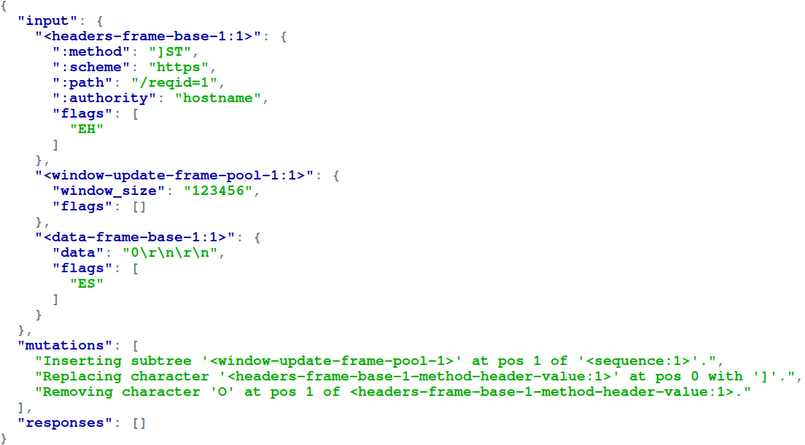

# Frameshifter

Frameshifter is a grammar-based HTTP/2 fuzzer with mutation ability. This tool was developed for a research paper (titled "FRAMESHIFTER : Security Implications of HTTP/2-to-HTTP/1 Conversion Anomalies") published at [USENIX Security 2022](https://www.usenix.org/conference/usenixsecurity22/presentation/jabiyev).

## Getting Started (using docker)

If you run the commands shown below in the given order, you will have a running container where the Frameshifter is installed and a file (i.e., `/tmp/output`) which contains a couple of mutated HTTP/2 inputs created by the tool. Please, note that the fourth and fifth commands are supposed to be run in the opened container shell.

1. `git clone https://github.com/bahruzjabiyev/frameshifter && cd frameshifter` (cloning the repo)

2. `docker build -t tool/frameshifter .` (building the tool image)

3. `docker run -ti tool/frameshifter bash` (running a container)

4. `source scapyenv/bin/activate` (switching to the virtual environment where the libraries are installed)

5. `seq 1 5 > /tmp/seeds; python3 /src/main.py -i -t -c /conf/simple_conf -f /tmp/seeds -o /tmp/output; jq '.' /tmp/output`

## About
A user-specified configuration file (see an example [here](conf/simple_conf)) tells Frameshifter how to generate and mutate HTTP/2 inputs and where to deliver them. To generate inputs, Frameshifter uses an input grammar (see `config.grammar` [here](conf/simple_conf)). Once the input is generated, a number (which is decided by the configuration) of mutations are applied. Mutations can be two types: content and sequence. The configuration decides (see `config.symbol_mutation_types`) what type of mutation can be applied on what input component. Both content and sequence mutations have their mutators defined in the configuration (see `config.string_mutators` and `config.tree_mutators`). Mutators which add or replace, uses a pool to pick the new element to add or to replace with (see `config.char_pool` and `config.char_pool`). Finally, the configuration also lists the target addresses.

## Examples
Let's remember how we ran the tool and created `/tmp/output`.

`seq 1 5 > /tmp/seeds; python3 /src/main.py -i -t -c /conf/simple_conf -f /tmp/seeds -o /tmp/output; jq '.' /tmp/output`

First, `/tmp/seeds` file is created containing numbers from 1 to 5. This file is fed as an input to the tool with the `-f` option and the tool uses each of these numbers as a seed to create and mutate an input. The `-t` option put the tool in the testing mode and instructs the tool not to deliver the inputs. Finally, the `-o` option specifies where to save the inputs for us to look at. Let's start from the seed number 1 (i.e., `jq '.["seeds"]["1"]' /tmp/output`).

